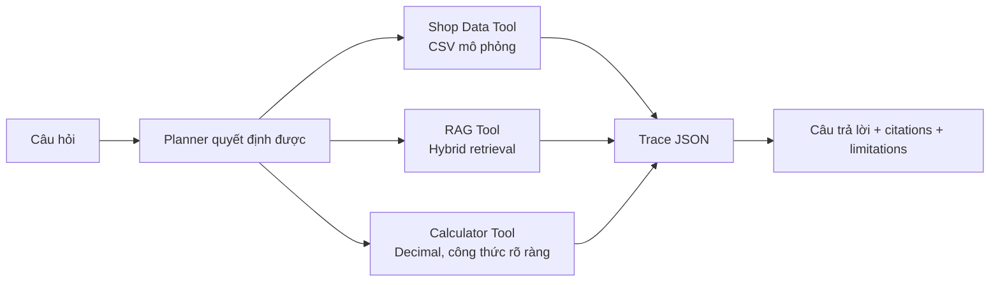

# Agent Baseline — dữ liệu shop mô phỏng

## Mục tiêu

Agent baseline chứng minh luồng chọn và phối hợp nhiều tool theo cách có thể
kiểm thử. Nó **không** tuyên bố kết nối với Shopee Seller Centre hay một shop
thật. Toàn bộ số liệu vận hành đến từ `data/shop_mock/` và mỗi câu trả lời đều
gắn nhãn phạm vi dữ liệu này.



## Thành phần

| File | Vai trò |
| --- | --- |
| `src/agent/planner.py` | Lập kế hoạch theo rule, nhận diện kỳ thời gian và out-of-scope. |
| `src/agent/shop_data_tool.py` | Đọc CSV mock, tính sales, tồn kho và quảng cáo chỉ đọc. |
| `src/agent/rag_tool.py` | Gọi hybrid retrieval, trả evidence có tài liệu/trang. |
| `src/agent/calculator_tool.py` | Xếp hạng chi phí bằng `Decimal`, có công thức trong output. |
| `src/agent/agent_runner.py` | Điều phối tool, tạo answer, citation, trace và limitations. |
| `src/agent/run_agent.py` | CLI demo. |

## Dữ liệu mock

| Dataset | Nội dung |
| --- | --- |
| `orders.csv` | Đơn hoàn tất/hủy, GMV, giảm giá và các phí ước tính. |
| `products.csv` | Danh mục sản phẩm minh họa. |
| `inventory.csv` | Tồn thực, giữ chỗ và ngưỡng nhập lại. |
| `ads.csv` | Chi phí quảng cáo, doanh thu quy gán, số đơn. |

Với `orders.csv`, doanh thu sau phí ước tính được xác định minh bạch:

```text
GMV - seller_discount - estimated_transaction_fee - estimated_service_fee
```

Không được diễn giải các trường `estimated_*` như mức phí Shopee hiện hành. Các
trường chỉ là đầu vào mô phỏng để kiểm chứng phép tính Agent; mức phí/chính sách
phải được kiểm tra qua RAG evidence.

## Chạy demo Agent

```powershell
cd C:\Users\Powder\Desktop\DoAnThacSi\master-thesis-rag-agent
.\.venv\Scripts\python.exe src\agent\run_agent.py `
  "Tháng 8 năm 2026 shop tôi có doanh thu bao nhiêu và theo chính sách Shopee các khoản phí nào cần đối chiếu?" `
  --json
```

Output chứa:

- `plan`: intent, danh sách tool, kỳ thời gian và lý do.
- `trace`: từng tool, trạng thái, input-derived result hoặc lỗi.
- `citations`: tài liệu/trang/excerpt truy hồi được.
- `limitations`: ranh giới dữ liệu mock và RAG evidence.

## Đánh giá

```powershell
.\.venv\Scripts\python.exe -m unittest tests\test_agent.py
.\.venv\Scripts\python.exe src\evaluation\agent_eval.py
```

`agent_eval_dataset.jsonl` gồm 32 câu, bao phủ policy-only, shop-data-only,
multi-tool và out-of-scope. Baseline hiện đánh giá **planner/tool routing**:
intent accuracy, tool exact match, precision, recall và F1. Đánh giá Agent đầy
đủ ở phase sau cần thêm task success, calculation exact match, citation
correctness, refusal correctness và latency trên câu hỏi được annotation độc lập.

Dataset hiện là seed test đi cùng rule baseline, nên `gold_verified` mặc định là
false và score từ nó chỉ là regression check, không phải kết quả luận văn. Cờ
`--require-verified` sẽ từ chối chạy chính thức cho đến khi bộ câu hỏi được
annotation độc lập và gắn `gold_verified=true`.

## Giới hạn trước khi tích hợp UI

- Planner là rule-based để có baseline dễ audit, chưa phải LLM planner.
- Agent trả tóm tắt có cấu trúc, không dùng Ollama để tổng hợp đa tool.
- Agent chưa được gắn vào Streamlit V19; giữ tách biệt cho đến khi evaluation
  đạt yêu cầu để tránh làm nhiễu RAG baseline.
- RAG evidence phụ thuộc chất lượng index/benchmark hiện tại. Không dùng output
  đó để khẳng định chính sách nếu chưa kiểm tra citation.
