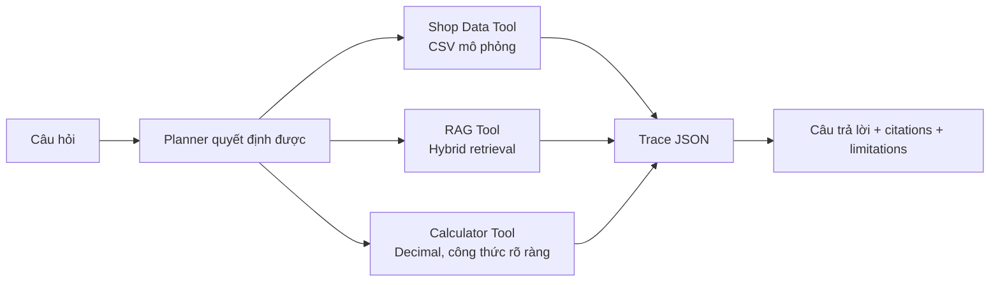

# Agent Baseline — dữ liệu shop mô phỏng

## Mục tiêu

Agent baseline chứng minh luồng chọn và phối hợp nhiều tool theo cách có thể
kiểm thử. Nó **không** tuyên bố kết nối với Shopee Seller Centre hay một shop
thật. Toàn bộ số liệu vận hành đến từ `data/shop_mock/` và mỗi câu trả lời đều
gắn nhãn phạm vi dữ liệu này.



## Thành phần

| File | Vai trò |
| --- | --- |
| `src/agent/planner.py` | Lập kế hoạch theo rule, nhận diện kỳ thời gian và out-of-scope. |
| `src/agent/shop_data_tool.py` | Đọc CSV mock, tính sales, tồn kho và quảng cáo chỉ đọc. |
| `src/agent/rag_tool.py` | Gọi hybrid retrieval, trả evidence có tài liệu/trang. |
| `src/agent/calculator_tool.py` | Xếp hạng chi phí bằng `Decimal`, có công thức trong output. |
| `src/agent/agent_runner.py` | Điều phối tool, tạo answer, citation, trace và limitations. |
| `src/agent/run_agent.py` | CLI demo. |
| `src/agent/streamlit_view.py` | Agent view dùng chung cho app chuẩn và demo độc lập; state tách khỏi hội thoại RAG. |

## Dữ liệu mock

| Dataset | Nội dung |
| --- | --- |
| `orders.csv` | Đơn hoàn tất/hủy, GMV, giảm giá và các phí ước tính. |
| `products.csv` | Danh mục sản phẩm minh họa. |
| `inventory.csv` | Tồn thực, giữ chỗ và ngưỡng nhập lại. |
| `ads.csv` | Chi phí quảng cáo, doanh thu quy gán, số đơn. |

Với `orders.csv`, doanh thu sau phí ước tính được xác định minh bạch:

```text
GMV - seller_discount - estimated_transaction_fee - estimated_service_fee
```

Không được diễn giải các trường `estimated_*` như mức phí Shopee hiện hành. Các
trường chỉ là đầu vào mô phỏng để kiểm chứng phép tính Agent; mức phí/chính sách
phải được kiểm tra qua RAG evidence.

## Chạy demo Agent

Trong giao diện chuẩn V19, chọn **Agent đa công cụ** ở sidebar. Chế độ này giữ
lịch sử riêng, chỉ tải tài nguyên RAG khi Agent thật sự gọi RAG Tool và luôn
hiển thị cảnh báo dữ liệu mock. Luồng demo nên dùng là **Doanh thu và phí** rồi
mở **Plan và tool trace** để thấy thứ tự `shop_data → rag → calculator`.

Vẫn có thể chạy riêng để dự phòng khi trình diễn:

```powershell
.\.venv\Scripts\streamlit.exe run src\agent_demo.py
```

CLI dùng khi cần trình bày trace JSON nguyên vẹn hoặc làm phương án dự phòng:

```powershell
cd C:\Users\Powder\Desktop\DoAnThacSi\master-thesis-rag-agent
.\.venv\Scripts\python.exe src\agent\run_agent.py `
  "Tháng 8 năm 2026 shop tôi có doanh thu bao nhiêu và theo chính sách Shopee các khoản phí nào cần đối chiếu?" `
  --json
```

Output chứa:

- `plan`: intent, danh sách tool, kỳ thời gian và lý do.
- `trace`: từng tool, trạng thái, input-derived result hoặc lỗi.
- `citations`: tài liệu/trang/excerpt truy hồi được.
- `limitations`: ranh giới dữ liệu mock và RAG evidence.

## Đánh giá

```powershell
.\.venv\Scripts\python.exe -m unittest tests\test_agent.py
.\.venv\Scripts\python.exe src\evaluation\agent_eval.py
```

`agent_eval_dataset.jsonl` là seed legacy 32 câu, bao phủ policy-only,
shop-data-only, multi-tool và out-of-scope. `agent_benchmark_candidate_v1.jsonl`
là candidate kế thừa có split cố định DEV 16 / TEST 10 / CHALLENGE 6. Mọi dòng
candidate chủ đích có `gold_verified=false`; score của nó chỉ là regression
check, không phải kết quả luận văn.

Baseline đánh giá **planner/tool routing** bằng intent accuracy, tool exact
match, precision, recall và F1. Trước khi chạy chính thức, dùng workbench để
kiểm duyệt độc lập intent/tool/period; task RAG cần `document_id` + xác nhận
nguồn, task dữ liệu mock/tính toán cần answer marker. Hướng dẫn đầy đủ ở
[`docs/agent_annotation_protocol.md`](agent_annotation_protocol.md). Cờ
`--require-verified` từ chối cả nhãn `gold_verified` thiếu lẫn các thành phần
review bắt buộc.

### Đánh giá end-to-end

Evaluation end-to-end thực thi Agent, thay vì chỉ kiểm tra planner. Nó đo intent
và danh sách tool, việc tool có hoàn thành trong trace, citation của câu hỏi
RAG, cảnh báo dữ liệu mock cho câu hỏi shop, refusal ngoài phạm vi, period
parsing, lỗi trace, độ trễ và — sau annotation — citation document correctness
/ answer-marker correctness:

```powershell
.\.venv\Scripts\python.exe src\evaluation\agent_end_to_end_eval.py
```

Kết quả nằm trong `data/processed/agent_end_to_end_eval_*.csv`. Candidate hiện
vẫn chưa được annotation độc lập, vì vậy các score này không được dùng làm
claim của luận văn. Khi bộ TEST được kiểm duyệt, chạy reviewed copy với
`--split test --require-verified`; manifest khi đó sẽ ghi trạng thái evidence
và Git revision.

## Giới hạn trước khi bảo vệ

- Planner là rule-based để có baseline dễ audit, chưa phải LLM planner.
- Agent trả tóm tắt có cấu trúc, không dùng Ollama để tổng hợp đa tool.
- Agent đã có một chế độ UI trong V19 và demo độc lập (`src/agent_demo.py`),
  nhưng vẫn tách state khỏi hội thoại RAG để không làm nhiễu baseline RAG.
- RAG evidence phụ thuộc chất lượng index/benchmark hiện tại. Không dùng output
  đó để khẳng định chính sách nếu chưa kiểm tra citation.
- Lần gọi Agent đầu tiên có thể chậm do tải embedding local; các lần sau dùng
  resource cache của Streamlit.
