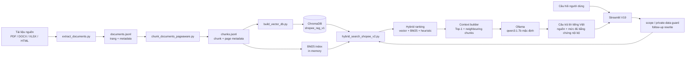
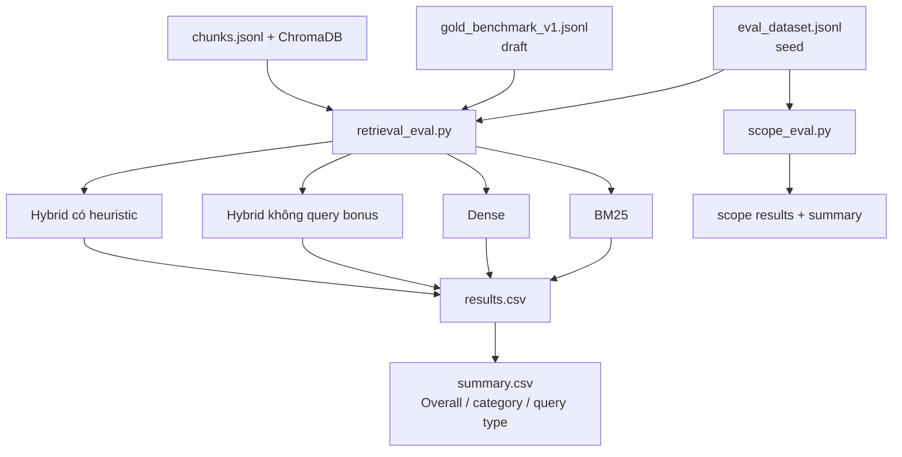
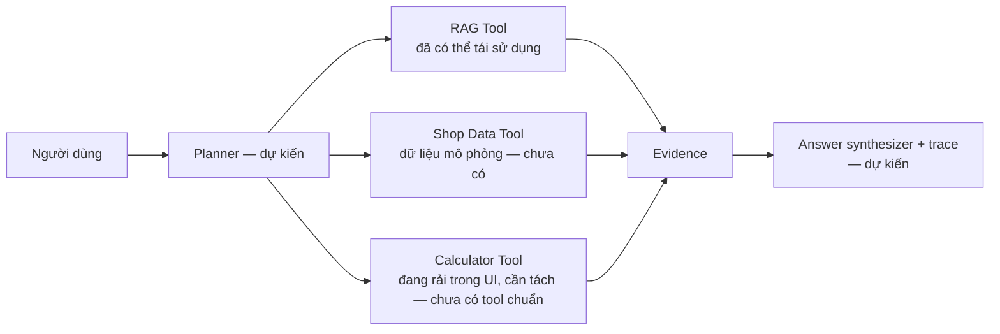

# Kiến trúc Baseline V19

Tài liệu này mô tả đúng hệ thống đang chạy, không mô tả Agent như một thành phần đã tồn tại. Mục tiêu là tách rõ **RAG baseline**, **pipeline đánh giá** và **lớp Agent dự kiến**.

## 1. Luồng RAG hiện tại

### Thành phần và trách nhiệm

| Thành phần | Trách nhiệm | Ghi chú |
| --- | --- | --- |
| `extract_documents.py` | Trích xuất, làm sạch, gắn metadata và trang tài liệu | Tạo `documents.jsonl` cùng log audit. |
| `chunk_documents_pageaware.py` | Chia đoạn theo section, giữ thông tin trang và overlap | Tạo `chunks.jsonl`. |
| `build_vector_db.py` | Sinh embedding và ghi ChromaDB | Collection mặc định `shopee_rag_v1`. |
| `hybrid_search_shopee_v2.py` | BM25, dense retrieval, chuẩn hóa và hybrid ranking | Weights mặc định dense 0.62, BM25 0.38. |
| `shopee_rag_complete_v4_0_1.py` | Quy tắc RAG, context builder, prompt, Ollama, history | Dùng tối đa 4 context chunks / 5.200 ký tự. |
| `shopee_chat_web_v19.py` | UI, hội thoại, nguồn, feedback, export | Đây là entry point duy nhất cho demo. |

## 2. Luồng đánh giá tách biệt

Evaluation không nhập `shopee_chat_web_v19.py`, không gọi Ollama, không dùng lịch sử hội thoại, quick path, hard-coded answer hoặc citation tĩnh. Vì vậy, nó đo retrieval chứ không đo chất lượng giao diện hoặc generation end-to-end.

## 3. Confidence và phạm vi trả lời

Baseline có:

- Guard câu hỏi cần dữ liệu nội bộ cửa hàng.
- Phân luồng scope trong `scope_eval.py`: `answerable`, `private_shop_data`, `out_of_scope`.
- Hàm `response_confidence` trong UI/back-end.

Giá trị `confidence` (tên key lịch sử) hiện chỉ là điểm heuristic 0--100 về
mức đủ của evidence retrieval và quy tắc; nó **không phải** xác suất đúng đã
được calibration. Trong luận văn, gọi nó là *evidence sufficiency level* / mức
độ đầy đủ bằng chứng nội bộ, đồng thời đánh giá riêng bằng benchmark trước khi
phát biểu về độ tin cậy.

## 4. Ranh giới hiện tại và Agent dự kiến

Agent chưa được tính là hiện hữu cho tới khi có ít nhất: lựa chọn tool có cấu trúc, dữ liệu cửa hàng mô phỏng, phép tính có thể kiểm chứng, trace từng bước và bộ đánh giá agent riêng.
